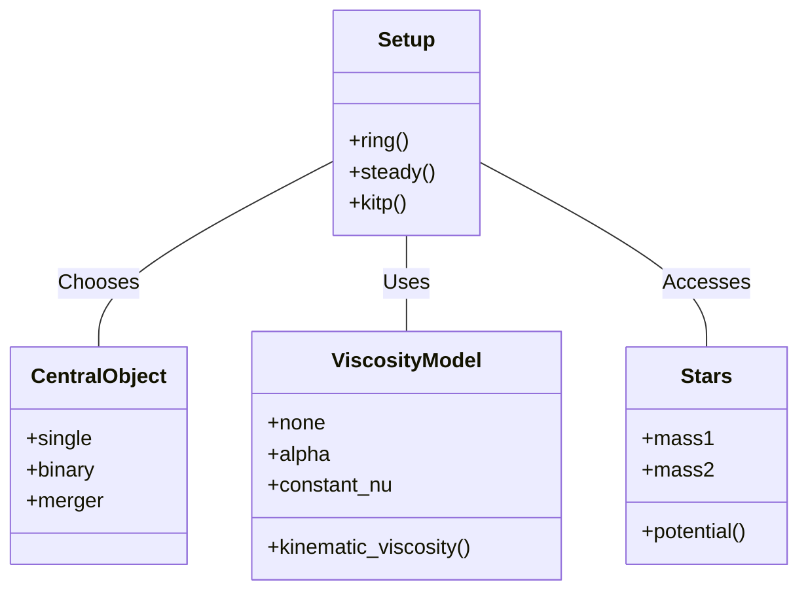

## Class Diagrams

```mermaid
classDiagram
    class Setup {
        +ring()
        +steady()
        +kitp()
    }

    class CentralObject {
        +single
        +binary
        +merger
    }

    class ViscosityModel {
        +none
        +alpha
        +constant_nu
        +kinematic_viscosity()
    }

    class Stars {
        +mass1
        +mass2
        +potential()
    }

    Setup -- CentralObject: Chooses
    Setup -- ViscosityModel: Uses
    Setup -- Stars: Accesses
```