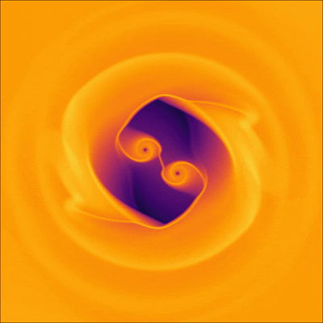
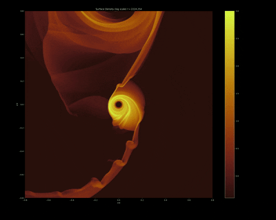

## Disk Initial Conditions

!!! abstract "Disk Initial Conditions"
    Sailfish currently supports three hydrodynamic initial conditions, including the one used in the Santa Barbara Code Comparison, and the viscous spreaing ring described in the classic Pringle (1981) review article. Note that the hydrodynamic initial condition type is controlled by the configuration keyword `setup` (this might change to a better name such as `disk_ic` in the future).

---

## Supported Initial Disk Types

<div class="grid cards" markdown>

-   :material-ring: `setup=ring`

    ---

    **Pringle Viscous Ring** - A circular ring of gas at unit separation from the central object

    Used for testing numerical accuracy and rate of convergence. Note that the `tstart` configuration item determines the ring width at the start of the simulation. Works only with the constant-nu viscosity model.

-   :material-target: `setup=steady`

    ---

    **Equilibrium Accretion Disk** - An effectively infinite, axisymmetric steady-state viscous flow

    The disk initially extends from the outer domain radius to the origin (or the inner domain radius in polar mesh mode). Constant-alpha and constant-nu viscosity models are supported.

-   :material-telescope: `setup=kitp`

    ---

    **Binary Disk Interactions** - The initial condition used in the Santa Barbara Code Comparison from Duffell et al. (2024)

    This initial condition includes a low-density cavity around around the binary, and a small perturbation to seed growth of the eccentric disk mode.

</div>

---

## Binary Disk Simulations

### Equal Mass Binary System

!!! example "Binary Disk Evolution"
    **Configuration**: Equal mass binary • `sink_size = 0.05` • `nu = 10⁻³`

<figure markdown>
  { width="80%" }
  <figcaption><strong>Binary disk evolution showing gap formation and spiral wave propagation - Madeline Clyburn</strong><br>
  The disk develops a central cavity as gravitational torques clear material near the binary. Spiral density waves propagate outward, redistributing angular momentum throughout the disk.</figcaption>
</figure>


---

### Binary Black Hole Merger

!!! warning "Gravitational Wave Phase"
    **Configuration**: Merger evolution • GW inspiral • Same disk parameters

<figure markdown>
  { width="80%" }
  <figcaption><strong>Binary merger simulation showing inspiral and final coalescence - Madeline Clyburn</strong><br>
  The binary separation decreases following GW inspiral until merger at t=0. The disk responds dynamically to the changing gravitational potential, exhibiting complex flow patterns.</figcaption>
</figure>


---

### Following Secondary BH in a Binary

!!! tip "Numerical Considerations"
    **Configuration**: `sink_size = 0.2` • `rsoft = 10.0` • Focus on secondary BH

<figure markdown>
  { width="80%" }
  <figcaption><strong>Binary simulation showing the secondary BH scraping the inner edge of the circumbinary disk - Akhil Nair</strong><br>
  In this simulation the gravitational softening length is 10x bigger than the base configuration</figcaption>
</figure>


---

## Configuration Details

### Central Object Types

=== "Single"
    ```cfg title="Single Black Hole"
    central_object = single
    sink_size = 0.05
    sink_rate = 10.0
    ```

    Perfect for studying **isolated accretion disks** around single compact objects.

=== "Binary"
    ```cfg title="Binary System"
    central_object = binary
    mass_ratio = 1.0      # Equal mass
    a = 1.0               # Separation
    sink_size = 0.05
    ```

    Ideal for **circumbinary disk** studies and gravitational wave astronomy.

=== "Merger"
    ```cfg title="Inspiral & Merger"
    central_object = merger
    mass_ratio = 1.0
    tstart = -100         # Start during inspiral
    tfinal = 10           # Continue post-merger
    ```

    Advanced scenarios for **pre/post-merger** disk evolution studies.

---

## Physics Parameters

!!! info "Key Physical Scales"

    | Parameter | Typical Value | Physical Meaning |
    |-----------|---------------|------------------|
    | **`nu`** | `10⁻³` | Kinematic viscosity |
    | **`sink_size`** | `0.05 - 0.2` | Accretion region size |
    | **`rsoft`** | `1.0 - 10.0` | Gravitational softening length |
    | **`mass_ratio`** | `0.1 - 1.0` | Secondary/primary mass ratio |

!!! success "Simulation Goals"

    **Method Validation**: Use Ring setup with analytical solutions

    **Astrophysical Modeling**: Binary/merger setups for GW astronomy

    **Parameter Studies**: Vary `nu`, `sink_size`, `rsoft` systematically

    **Comparative Analysis**: Different central object configurations

---

## Getting Started

!!! tip "Quick Start Guide"
    1. **Choose your setup** based on research goals
    2. **Configure parameters** using the preset files in `/presets/`
    3. **Run simulation**: `./bin/sailfish_gpu presets/your_setup.cfg`
    4. **Analyze results** using the diagnostic outputs

[:material-rocket-launch: **View Presets**](presets.md){ .md-button .md-button--primary }
[:material-chart-line: **Numerical Methods**](numerical-methods.md){ .md-button }
