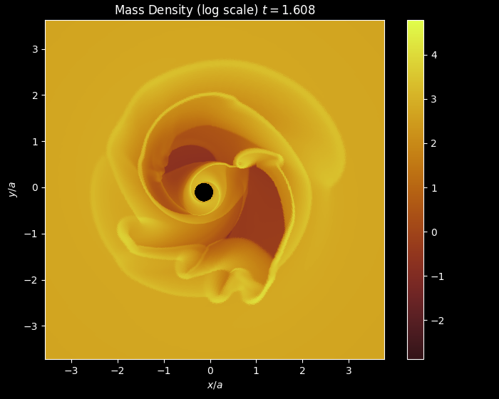
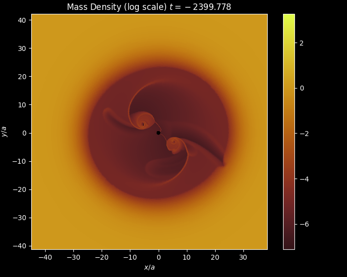

# Tutorial

This tutorial section provides step-by-step guides for different Sailfish simulation scenarios.

## [Non-excised Binary](#non-excised-binary)

<a name="non-excised-binary"></a>

This tutorial covers setting up a binary system simulation without excision.


### Step 1: Configuration
Create the configuration file for non-excised binary simulation:

```ini
# Create binary.cfg file
fold = 500
rk = 2
beta = 0
alpha = 0.01
nu = 0
mach = 10
mass_ratio = 0.2
eccentricity = 0
a = 1.0
ell = 0
theta = 1.5
tstart = 0
tfinal = 10.0
tunits = -1
cfl = 0.2
cpi = 10.0
spi = 1.0
tsi = 0.001
dx = 0.01
sink_size = 0.2
sink_rate = 10
mesh_omega = 0
mesh_contract = false
mesh_wobble = true
domain = 0.2 100
sp = 0,1,2,3,4,5,6,7,8,9,10
ts = 0,1,2,3,4,5,6,7,8,9,10,20
outdir = .
setup = steady
mesh = polar
thermodynamics = local_iso
central_object = binary
bc = outflow
diagnostic_set = custom
```

### Step 2: Run the Test
Compile and execute the simulation:

```bash
# Compile with GPU support
make gpu

# Run the simulation
./bin/sailfish_gpu binary.cfg
```

Monitor the simulation progress in the terminal output.

### Step 3: Analyze Files
Analyze the simulation results using basic plotting code:

```python
import numpy as np
import matplotlib.pyplot as plt
from h5py import File

# Load and plot 2D surface density
def plot_2d_surface_density(filename):
    with File(filename, "r") as f:
        # Get time
        t = f["__time__"][...]
        
        # Get mesh coordinates
        x_vertices = f["x_vertices"][...]
        y_vertices = f["y_vertices"][...]
        
        # Get surface density data
        mass_density = f["mass_density"][...]
        
        # Create the plot
        fig, ax = plt.subplots(figsize=(10, 8))
        
        # Plot surface density
        im = ax.pcolormesh(x_vertices, y_vertices, mass_density, 
                          shading="flat", cmap="viridis")
        
        # Add colorbar
        cbar = plt.colorbar(im, ax=ax)
        cbar.set_label('Surface Density')
        
        # Set labels and title
        ax.set_xlabel('x/a')
        ax.set_ylabel('y/a')
        ax.set_title(f'Surface Density at t = {t:.3f}')
        ax.set_aspect('equal')
        
        plt.tight_layout()
        plt.show()

# Example usage
plot_2d_surface_density('prods.0001.h5')

# Plot multiple time steps
import glob
files = sorted(glob.glob('prods.*.h5'))
for filename in files[:5]:  # Plot first 5 files
    plot_2d_surface_density(filename)
```



## [Non-excised Merger](#non-excised-merger)

<a name="non-excised-merger"></a>

This tutorial demonstrates merger simulations without excision techniques.


### Step 1: Configuration
Set up the merger simulation configuration:

```ini
# Create merger.cfg file
rk = 2
beta = 0
alpha = 0
nu = 0.001
mach = 10
mass_ratio = 1.0
eccentricity = 0
a = 1
ell = 0
theta = 1.5
tstart = -2500
tfinal = -2400
tunits = 1
cfl = 0.25
fold = 100
dx = 0.01
cpi = 10
spi = 10
tsi = 0.01
sink_size = 0.1
sink_shape = 4.0
sink_rate = 10
rsoft = 1.0
mesh_omega = 0
mesh_contract = true
mesh_wobble = false
domain = 0.1,100
setup = kitp
mesh = polar
thermodynamics = local_iso
central_object = merger
bc = outflow
diagnostic_set = all
```

### Step 2: Run the Test
Compile and execute the merger simulation:

```bash
# Compile with GPU support
make gpu

# Run the simulation
./bin/sailfish_gpu merger.cfg
```

Monitor the simulation for convergence and stability.

### Step 3: Analyze Files
Analyze the merger results using similar plotting code as the binary tutorial.



## [Excised Binary KITP](#excised-binary-kitp)

<a name="excised-binary-kitp"></a>

This tutorial covers KITP-style excised binary simulations.

### Step 1: Configuration

### Step 2: Run the Test

### Step 3: Analyze Files
